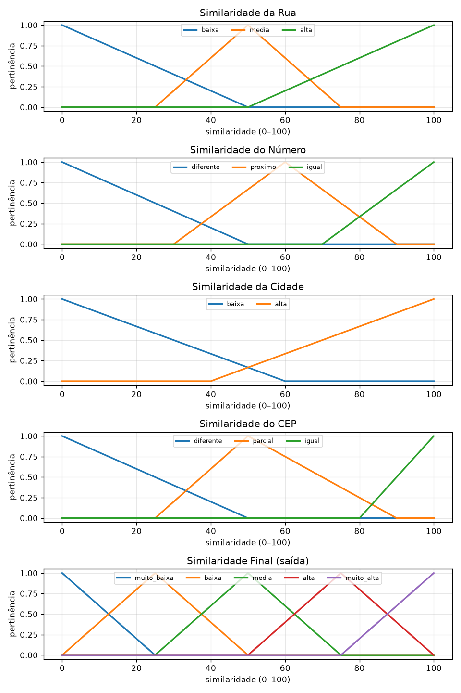

# Fuzzy Address Matcher

Comparador inteligente de endereços usando **Sistemas Nebulosos (Fuzzy Logic)**.

O sistema recebe **dois endereços em texto livre**, decompõe cada um em
componentes estruturados (rua, número, bairro, cidade, estado, CEP) e calcula
um **índice de similaridade de 0 a 100** usando um sistema de inferência
fuzzy de Mamdani, com defuzzificação por centroide.

Além do score, o sistema produz:

- uma **classificação textual**: `diferentes`, `parecidos`, `muito semelhantes`, `provavelmente iguais`;
- uma **explicação** legível dos fatores que influenciaram o resultado;
- as **regras fuzzy ativadas** (explicabilidade).

---

## 1. O problema

Comparar endereços é difícil porque a mesma localização pode ser escrita de
muitas formas:

```
"Av Afonso Pena 1000 Centro Belo Horizonte MG"
"Avenida Afonso Pena, 1000, Centro, BH - MG"
```

Abreviações (`Av` / `Avenida`), pontuação, acentos, ordem dos campos, erros de
digitação e CEPs parciais tornam a comparação literal (string igual) inútil.

A solução clássica é medir **similaridade aproximada** campo a campo. Mas
combinar essas similaridades parciais num veredito final é justamente um
problema de **raciocínio aproximado** — perfeito para **lógica fuzzy**, que
lida nativamente com noções vagas como "rua *parecida*" ou "número *próximo*".

---

## 2. Conceitos de Lógica Fuzzy usados

| Conceito | Onde aparece no projeto |
|---|---|
| **Variáveis linguísticas** | `street`, `number`, `city`, `cep` (entradas) e `final` (saída) |
| **Termos / conjuntos fuzzy** | `baixa`, `média`, `alta`, `igual`, `próximo`, … |
| **Funções de pertinência** | triangulares (`trimf`) — ver gráfico abaixo |
| **Base de regras** | 22 regras `SE … ENTÃO …` em [`app/rules.py`](app/rules.py) |
| **Operador E (AND)** | mínimo (padrão Mamdani) |
| **Inferência de Mamdani** | implicação por mínimo, agregação por máximo |
| **Defuzzificação** | **centroide** (centro de gravidade) |

### Funções de pertinência

Gere a imagem com `python app/viz.py` (salva em `data/membership_functions.png`):



#### Explicação matemática

Todas as variáveis usam o universo de discurso `U = [0, 100]` e funções de
pertinência **triangulares**. Uma função triangular `trimf(x; a, b, c)` é
definida por:

```
           ⎧ 0,                  x ≤ a
           ⎪ (x - a) / (b - a),  a < x ≤ b
μ(x) =     ⎨
           ⎪ (c - x) / (c - b),  b < x < c
           ⎩ 0,                  x ≥ c
```

onde `a` e `c` são a base e `b` é o pico (onde `μ = 1`).

Exemplo — similaridade da **rua**:

```
baixa = trimf(0,  0,  50)
media = trimf(25, 50, 75)
alta  = trimf(50, 100, 100)
```

A inferência de **Mamdani** segue 4 passos:

1. **Fuzzificação** — para cada entrada `x`, calcula-se `μ_termo(x)` em cada termo.
2. **Avaliação das regras** — a força de disparo de uma regra `SE A E B` é
   `min(μ_A, μ_B)`.
3. **Agregação** — os conjuntos de saída recortados por cada regra são
   combinados pelo **máximo**, formando um conjunto fuzzy resultante `μ_out(y)`.
4. **Defuzzificação (centroide)** — converte-se `μ_out` num número único:

```
        ∫ y · μ_out(y) dy
score = ─────────────────
          ∫ μ_out(y) dy
```

> **Calibração.** Por causa da sobreposição das funções de pertinência, o score
> cru do centroide satura em torno de ~80 (caso perfeito) e ~16 (caso nulo). O
> motor aplica uma normalização **min-max** desses extremos para devolver um
> score intuitivo em `[0, 100]`. Veja `FuzzyAddressEngine._calibrate`.

---

## 3. Arquitetura

Pipeline completo:

```
texto → normalizer → parser → similarity → fuzzy_engine → explainability → resultado
```

```
fuzzy_address_matcher/
├── app/
│   ├── normalizer.py      # lowercase, sem acentos, abreviações, pontuação
│   ├── parser.py          # decompõe o endereço em campos (regex + heurística)
│   ├── similarity.py      # similaridade por campo (RapidFuzz + regras de nº/CEP)
│   ├── rules.py           # base de 22 regras fuzzy (como dados)
│   ├── fuzzy_engine.py    # sistema Mamdani (scikit-fuzzy) + calibração
│   ├── explainability.py  # classificação textual + explicação
│   ├── viz.py             # gráficos das funções de pertinência
│   ├── batch.py           # comparação em lote via CSV + benchmark
│   ├── streamlit_app.py   # interface visual (opcional)
│   ├── api.py             # API REST (FastAPI)
│   └── main.py            # orquestração + CLI/demonstração
├── tests/
│   └── test_cases.py      # testes automatizados (pytest)
├── data/
│   └── sample_addresses.csv
├── requirements.txt
└── README.md
```

### Etapas

1. **Normalização** ([`normalizer.py`](app/normalizer.py)): minúsculas, remoção
   de acentos, expansão de abreviações (`Av.`→`avenida`, `apto`→`apartamento`),
   tratamento de vírgulas/hífens/CEP e colapso de espaços.
2. **Parsing** ([`parser.py`](app/parser.py)): extrai `street_type`,
   `street_name`, `number`, `district`, `city`, `state`, `zip_code`,
   `complement` usando regex + heurísticas + uso das vírgulas como delimitadores.
3. **Similaridade por campo** ([`similarity.py`](app/similarity.py)): combina
   `ratio`, `token_sort_ratio` e `partial_ratio` do **RapidFuzz** para texto;
   número e CEP têm tratamento próprio (proximidade numérica e prefixo comum).
4. **Inferência fuzzy** ([`fuzzy_engine.py`](app/fuzzy_engine.py)): aplica as
   regras de Mamdani e defuzzifica por centroide.
5. **Explicabilidade** ([`explainability.py`](app/explainability.py)): classifica
   o score e monta a explicação textual + regras ativadas.

---

## 4. Como executar

### Instalação

```bash
python -m venv .venv
source .venv/bin/activate        # Windows: .venv\Scripts\activate
pip install -r requirements.txt
```

### Demonstração via linha de comando

```bash
python app/main.py
# ou comparando dois endereços específicos:
python app/main.py "Av Afonso Pena 1000 BH MG" "Avenida Afonso Pena, 1000, Belo Horizonte - MG"
```

### API REST

```bash
uvicorn app.api:app --reload
```

Documentação interativa em <http://localhost:8000/docs>.

```bash
curl -X POST http://localhost:8000/compare \
  -H "Content-Type: application/json" \
  -d '{"address1":"Av Afonso Pena 1000 Centro Belo Horizonte MG",
       "address2":"Avenida Afonso Pena, 1000, Centro, BH - MG"}'
```

### Interface visual (Streamlit)

```bash
streamlit run app/streamlit_app.py
```

### Comparação em lote (CSV) + benchmark

```bash
python app/batch.py data/sample_addresses.csv data/results.csv
```

### Gráfico das funções de pertinência

```bash
python app/viz.py
```

### Testes

```bash
pytest -q
```

---

## 5. Exemplos de execução

```
A: Av Afonso Pena 1000 Centro Belo Horizonte MG
B: Avenida Afonso Pena, 1000, Centro, BH - MG

Score: 82.5  |  Classificação: muito semelhantes

A similaridade final foi 82.5/100, classificada como "muito semelhantes", porque:
  • o nome da rua é parecido (88%)
  • o número é idêntico
  • a cidade difere (33%)        ← "BH" vs "Belo Horizonte"
  • o estado coincide
  • o CEP é parcialmente correspondente (50%)

Principais regras fuzzy ativadas:
  • SE rua muito parecida e número idêntico (força 0.75) ENTÃO similaridade muito_alta
  • SE rua muito parecida e CEP parcialmente igual (força 0.75) ENTÃO similaridade alta
  • SE rua parecida mas cidade diferente (força 0.44) ENTÃO similaridade media
```

Resposta JSON da API:

```json
{
  "score": 82.5,
  "classification": "muito semelhantes",
  "details": {
    "street_similarity": 87.6,
    "number_similarity": 100.0,
    "city_similarity": 33.3,
    "zip_similarity": 50.0
  },
  "explanation": "A similaridade final foi 82.5/100, ..."
}
```

---

## 6. Variáveis e regras fuzzy

### Entradas

| Variável | Termos |
|---|---|
| `street` (rua) | `baixa`, `media`, `alta` |
| `number` (número) | `diferente`, `proximo`, `igual` |
| `city` (cidade) | `baixa`, `alta` |
| `cep` (CEP) | `diferente`, `parcial`, `igual` |

### Saída

| Variável | Termos |
|---|---|
| `final` | `muito_baixa`, `baixa`, `media`, `alta`, `muito_alta` |

### Exemplos de regras

```
SE rua É alta E numero É igual           ENTÃO similaridade É muito_alta
SE rua É alta E cidade É alta            ENTÃO similaridade É alta
SE cep É igual                           ENTÃO similaridade É muito_alta
SE rua É alta E numero É diferente       ENTÃO similaridade É media
SE rua É baixa                           ENTÃO similaridade É baixa
SE rua É baixa E cidade É baixa          ENTÃO similaridade É muito_baixa
```

A base completa (22 regras) está em [`app/rules.py`](app/rules.py).

---

## 7. Limitações (e por que são esperadas)

- O **parser é heurístico**. Endereços sem vírgulas separando os campos
  (ex.: `"Av Paulista 1000 São Paulo"`) dependem de heurísticas posicionais e
  podem errar a fronteira bairro/cidade.
- Abreviações de cidade muito agressivas (ex.: `BH`) não são expandidas, então
  contam como cidade diferente — visível no exemplo acima.

Essas limitações são aceitáveis e documentadas para um projeto **didático**,
cujo foco é demonstrar o **sistema nebuloso**, não construir um geocodificador
de produção.

---

## 8. Tecnologias

- Python 3.11+
- [scikit-fuzzy](https://pythonhosted.org/scikit-fuzzy/) — sistema fuzzy
- [RapidFuzz](https://github.com/rapidfuzz/RapidFuzz) — similaridade de strings
- [pandas](https://pandas.pydata.org/) / [numpy](https://numpy.org/) — dados
- [FastAPI](https://fastapi.tiangolo.com/) — API REST
- [Streamlit](https://streamlit.io/) — interface visual
- [matplotlib](https://matplotlib.org/) — gráficos das funções de pertinência
