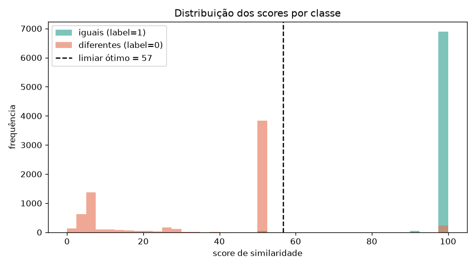
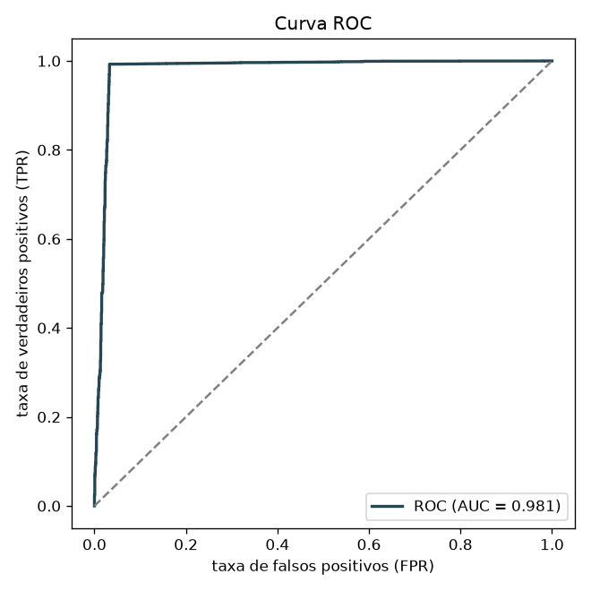
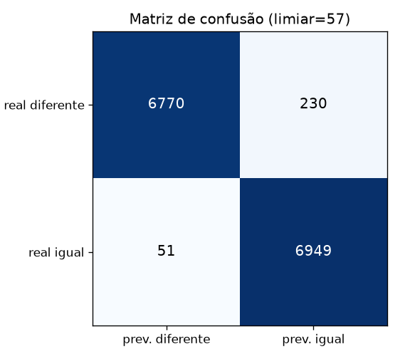
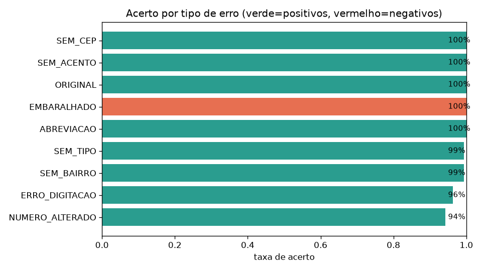

# Relatório de Eficácia — Fuzzy Address Matcher

_Gerado em 2026-06-25 21:55._

## Resumo do dataset

- Total de pares avaliados: **14,000**
- Positivos (mesmo endereço, `label=1`): **7,000**
- Negativos (`label=0`): **7,000** = 4,065 difíceis reais (número alterado) + 2,935 embaralhados
- Score médio dos positivos: **99.5** / dos negativos: **34.6**

## Desempenho global

**AUC (área sob a curva ROC): 0.981**  — mede a separação entre as classes independentemente do limiar (1.0 = perfeito, 0.5 = aleatório).

### Limiar ótimo por F1 (score ≥ 57)

- Acurácia: **98.0%**
- Precisão: **96.8%**
- Recall (sensibilidade): **99.3%**
- Especificidade: **96.7%**
- F1-score: **0.980**
- Matriz: TP=6949 · FP=230 · TN=6770 · FN=51

### Limiar ótimo por acurácia (score ≥ 57)

- Acurácia: **98.0%**
- Precisão: **96.8%**
- Recall (sensibilidade): **99.3%**
- Especificidade: **96.7%**
- F1-score: **0.980**
- Matriz: TP=6949 · FP=230 · TN=6770 · FN=51

### Usando a classificação textual

(prevê "igual" quando a classe é *muito semelhantes* ou *provavelmente iguais*)

- Acurácia: **98.0%**
- Precisão: **96.8%**
- Recall (sensibilidade): **99.2%**
- Especificidade: **96.7%**
- F1-score: **0.980**
- Matriz: TP=6946 · FP=230 · TN=6770 · FN=54

## Desempenho por tipo de erro

| Tipo de erro | N | Score médio | Score mediano | Taxa prevista "igual" | Acerto |
|---|---:|---:|---:|---:|---:|
| `NUMERO_ALTERADO` | 4065 | 52.8 | 50.0 | 5.7% | 94.3% |
| `ERRO_DIGITACAO` | 1000 | 98.1 | 100.0 | 96.3% | 96.3% |
| `SEM_BAIRRO` | 1000 | 99.4 | 100.0 | 99.3% | 99.3% |
| `SEM_TIPO` | 1000 | 98.9 | 100.0 | 99.3% | 99.3% |
| `ABREVIACAO` | 1000 | 100.0 | 100.0 | 100.0% | 100.0% |
| `EMBARALHADO` | 2935 | 9.4 | 6.4 | 0.0% | 100.0% |
| `ORIGINAL` | 1000 | 100.0 | 100.0 | 100.0% | 100.0% |
| `SEM_ACENTO` | 1000 | 100.0 | 100.0 | 100.0% | 100.0% |
| `SEM_CEP` | 1000 | 100.0 | 100.0 | 100.0% | 100.0% |

> Para tipos positivos, *acerto* = fração detectada como igual. Para `EMBARALHADO` (negativos), *acerto* = fração corretamente rejeitada como diferente.

## Observações e limitações

- A base contém **negativos difíceis reais** (`NUMERO_ALTERADO`): mesma rua, bairro, cidade e CEP, mudando **apenas o número**. Como o número é decisivo na identidade do endereço, esses pares são rotulados como diferentes (`label=0`) — é o teste mais exigente para o sistema.

- Adicionalmente, podem ser gerados negativos "fáceis" por **embaralhamento** (`EMBARALHADO`): endereços completamente distintos. A quantidade é controlada por `--extra-negatives`.

- Cerca de 0,6% dos `NUMERO_ALTERADO` têm número idêntico ao original (ruído da geração): nesses casos o sistema corretamente os vê como iguais, mas o rótulo diz diferente — um teto natural de acerto para essa categoria.

## Gráficos

